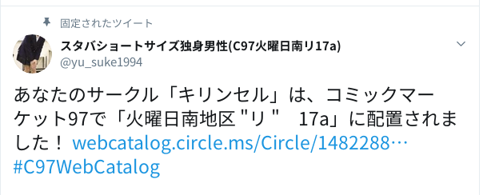

# 同人誌執筆\\n(ハードモード)
subtitle
: 2019-12-05

subtitle
: 表参道.rb #53

author
: うなすけ

theme
: unasuke-white

# 自己紹介
- 名前 : うなすけ
- 仕事 : フリーランスのプラグラマー
  - インフラ寄りサーバーサイドエンジニア
  - Ruby, Rails, Kubernetes...

- {::tag name="x-small"}GitHub [@unasuke](https://github.com/unasuke){:/tag}
- {::tag name="x-small"}Mastodon [@unasuke@mstdn.unasuke.com](https://mstdn.unasuke.com/@unasuke){:/tag}
- {::tag name="x-small"}Twitter [@yu\_suke1994](https://twitter.com/yu_suke1994){:/tag}

{:relative_width="24" align="right" relative_margin_right="-10" relative_margin_top="42"}

# コミックマーケット 97
みんな来て (大晦日)

{:relative_width="90"}

# pixivFANBOXまとめ とは
- 僕が毎日pixivFANBOXに投稿している内容をまとめたもの
  - RailsとMastodonの気になったissueやpull reqをピックアップ
  - たまにそれ以外のOSSについても投稿
    - これは限定公開(月500円)

<https://www.pixiv.net/fanbox/creator/7127248>

2018年5月からほぼ毎日継続 → 記事数はどうなる？

# 第一の難関
- pixivFANBOXにしかない投稿をローカルにもってくるには？
  - エクスポート機能はなし(問い合わせ済み)
  - 限定公開記事はログインしていないと閲覧不可

# 第一の難関 VS スクレイピング
- Rubyによるスクレイピングができないだろうか？
  - FANBOXのページでは何やらAPIからのJSONを元にレンダリングしている
  - Mechanize や Nokogiri の出番

勝ったなガハハ (11月末までこれでいけると思っていた)

# 第一の難関 VS スクレイピングの結果
- スクレイピングはできず
  - ログイン画面に存在する reCAPTCHA v3
    - これは突破できない……
    - 詰み

# 第一の難関、突破
- なんとかしてローカルに記事のdumpをもってくることができた
  - どうやって？
    - 気になる人は新刊を買いに来てくれ！

{:relative_width="90"}

# 第二の難関 (の前に)
- ところでこの場に同人誌を書いたことのある人ってどのくらい居ますか？
  - それは技術同人誌？
  - 組版どうしました？
    - TeX？ Re:VIEW？ Vivliostyle？ SATySFi？ InDesign？
- 同人誌を書いたことがない人へ
  - 本を作るためのツールはさまざまなものがあり、上のは有名なものの一例です

# 第二の難関 (の前に)
- 世の中には便利なものがある
  - <https://github.com/TechBooster/ReVIEW-Template>
  - 技術サークル TechBooster が公開しているRe:VIEWのテンプレート
  - とりあえずこれで本にしよう

# 第二の難関 (本題)
- どのようにHTMLをRe:VIEW記法にしていくか？
  - 記事のHTMLが一定でない
  - リンクをどう表現したものか？

最大の敵は記事数 (1200超)

突破できたら新刊でどうやって変換したかが読める！！！

# 締切について
- ねこのしっぽ : 12/13
- 栄光 : 12/22

最遅 12/29

<https://factory.pixiv.net/books/comike>

# まとめ
コミックマーケット 97 みんな来て (大晦日)

{:relative_width="90"}
